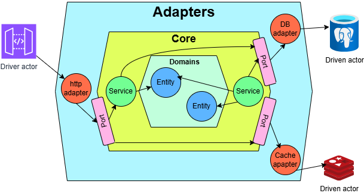

# Go RESTful API

Aplicação rest, desenvolvida em [Go](https://go.dev/), [Gin](https://gin-gonic.com/), [PostgreSQL](https://www.postgresql.org/) and [Redis](https://redis.io/).

## Executando a aplicação

1. Instalar o [Go](https://go.dev/dl/)
2. Instalar o [Docker Compose](https://docs.docker.com/compose/install/). Ele precisa ser iniciado.
3. Clonar a aplicação:

```bash
git clone git@github.com:cidmiranda/go-gin-rest.git
```

4. Vá até a pasta da aplicação

```bash
cd go-gin-rest
```

5. Execute a imagem docker com o postgres e o redis

```bash
docker-compose -f docker-compose.yml up --build
```

6. Em outro terminal execute a aplicação

```bash
go run cmd/http/main.go
```

7. Acesse a documentação da aplicação em http://localhost:8080/docs/index.html.

